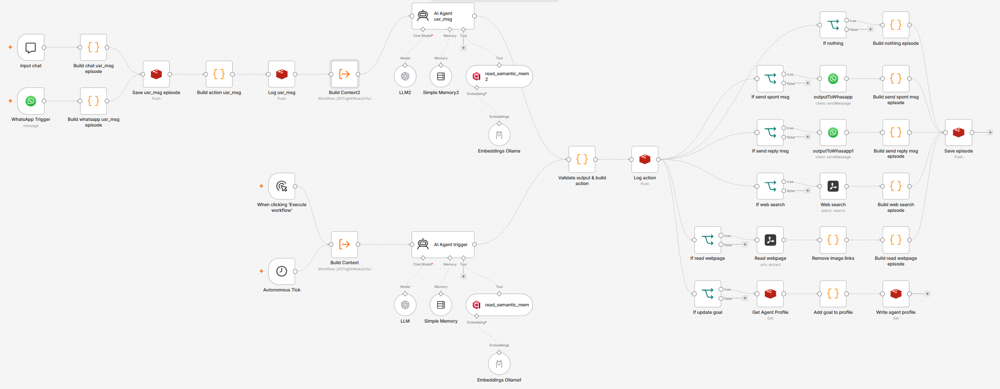

# Joshua, an Autonomous Agent

This project investigates whether we can use LLMs to **simulate an autonomous agent with its own mental life and will**.

It is an n8n-based agent with a persistent identity, interests, goals, user-aware context, and memory. The agent can decide to initiate conversations   with the user, respond to a user's message, research a topic, read a webpage, assign itself some goals to handle in the future, or remain idle. 

Each run receives the agent profile, user profile, recent activity, and recent discussion summaries.

## Main Design Principles

- Maintain a separate profile for the user and the agent.
- Record interactions and autonomous decisions as episodic memory.
- Consolidate older episodes into searchable semantic memory instead of injecting an ever-growing history into every prompt.
- Consolidate past discussions into injectable context.
- Support both user-triggered replies and spontaneous, scheduled activity.
- Keep operational memory maintenance separate from the agent's main reasoning loop.
- Use strict JSON contracts between the LLM prompts and the n8n workflows.

## Memory Model

The memory model and its Redis/Qdrant data structures are documented in [memories_specification.md](memories_specification.md). 

## How it works

The main workflow (see diagram below) loads context and invokes one of two prompt paths:

- **User message** (upper-left part of the diagram): an incoming WhatsApp message is recieved and the agent chooses whether to reply directly, search, read a page, update a goal or do nothing.
- **Autonomous tick** (bottom-left part of the diagram): an automatic trigger activates the agent which may research a topic, pursue a goal, send a spontaneous message or do nothing.



The supporting workflows provide the surrounding lifecycle:

| Workflow | Responsibility |
| --- | --- |
| `init` | Load the JSON profiles into Redis and optionally reset development data. |
| `build_context` | Assemble profiles, recent episodes, and discussion summaries for the main prompt. |
| `main` | Run scheduled or message-triggered reasoning and execute the selected action. |
| `summarise_discussions` | Periodically summarize recent conversations. |
| `consolidate_semantic_memory` | Turn older episodic content into embeddings and store it in Qdrant. |

## Technologies

- [n8n](https://n8n.io/) for workflow orchestration and scheduling.
- [Redis](http://redis.io/) for profiles, activity logs, episodic memory, and discussion summaries.
- [Qdrant](https://qdrant.tech/) for vector-based semantic memory.
- [Ollama](https://ollama.com/) for local text embedding inference.
- [Tavily](https://tavily.com/) for web search.
- [wwebjs-api](https://github.com/avoylenko/wwebjs-api) and an n8n WhatsApp node for messaging.

All services are deployed locally with Docker Compose.

## Start Guide

### Prerequisites

- Docker and Docker Compose.
- A Tavily API key if web search is enabled.
- A key for your LLM account (this installation uses an Open Router key)
- A WhatsApp account **for the agent** if the WhatsApp inbound messages are enabled. Note that you cannot use a unique phone number as the sender and receiver as the Whasapp API does not generate events for incoming messages in this case.

### 1. Create the external Docker volumes

The Compose file expects these volumes to exist before startup:

```
docker volume create n8n_data
docker volume create redis_data
docker volume create qdrant_storage
docker volume create ollama_storage
```

### 2. Start the services

From this directory:

```
docker compose up -d
```

The default service endpoints are:

- n8n: `http://localhost:5678`
- wwebjs-api: `http://localhost:3000`
- Redis: `localhost:6379`
- Qdrant: `http://localhost:6333`
- Ollama: `http://localhost:11434`

The Compose file currently uses the Europe/Paris timezone. Adjust it before deployment if needed.


### 3. Configure n8n

Install community node `n8n-nodes-wwebjs-api` to support communication with WhatsApp Web API:
- Doc: https://github.com/vgpastor/n8n-nodes-wwebjs-api
- In n8n, go to Settings -> Community Nodes, click Install a community node, enter node name "n8n-nodes-wwebjs-api", click Install

In n8n, configure credentials for:

1. Redis (empty password)
2. Ollama (empty key)
3. Qdrant (empty key)
4. Tavily (API key)
5. WhatsApp/wwebjs-api (empty key)
6. LLM key (this installation uses an Open Router key)

Install an embedding model for Ollama:

- Find the embedding model: https://ollama.com/search?c=embedding, choose https://ollama.com/library/nomic-embed-text
- Go to the ollama container on Docker Desktop and run: `ollama pull nomic-embed-text`


### 4. Import and initialize the workflows

In folder `share`, copy `example-agent-profile.json` and `example-user-profile.json` to `agent-profile.json` and `user-profile.json`.

Import the five JSON files from the `workflows` subdirectories into n8n. 

Once workflow `init` is imported, run it manually once to load the profiles from `share/` into Redis. 
The reset path in that workflow clears development data, so do not run it against a production instance without reviewing its nodes first.

Verify the proper intialisation by manually running `build_context`.

Publish the `main`, `consolidate_semantic_memory` and `summarise_discussions` workflows after verifying credentials.


### 5. Connect n8n to WhatsApp

Create a wwebjs-api session: http://localhost:3000/session/start/whatsapp

Then get the QR code etand scan it with WhatsApp (from the phone number assigned to the agent): http://localhost:3000/session/qr/whatsapp/image

Check the session status: http://localhost:3000/session/status/whatsapp

Verify that the webhook URL configured in `docker-compose.yml` matches the webhook exposed by the imported `main` workflow. 

The WhatsApp session is persisted in `wwebjs_sessions/`.

## License

This project is licensed under the [Apache License 2.0](LICENSE).
